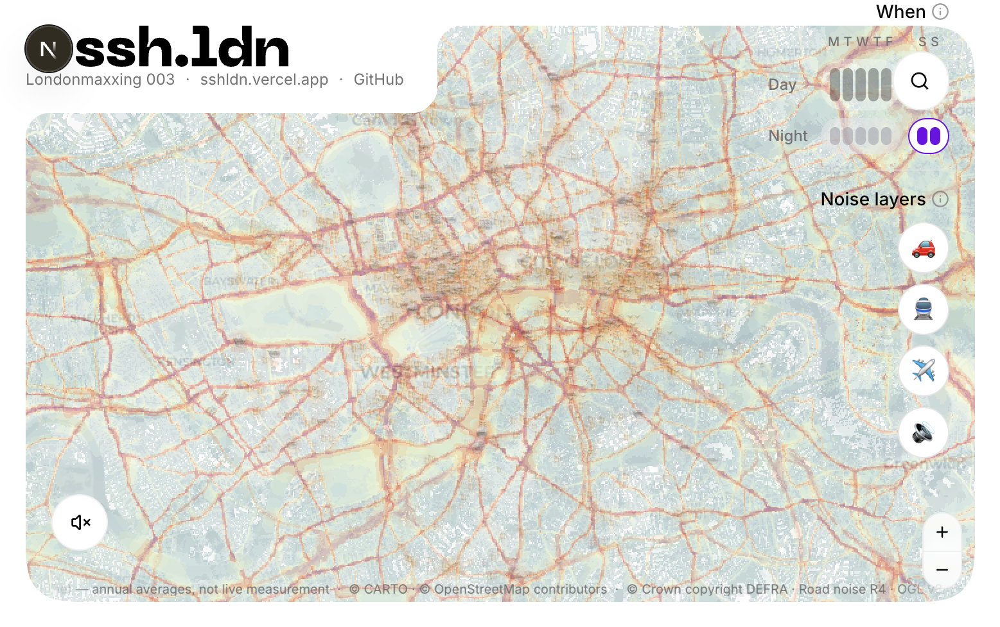

# ssh-ldn

**London Noise Map for renting, buying, and visiting.**

[Live demo → https://ssh-ldn.app](https://ssh-ldn.app) · [GitHub](https://github.com/ghcpuman902/ssh.ldn)

Built in one day at [Londonmaxxing 003](https://londonmaxxing.com) (4 July 2026) — *Live London* track.



## The problem

People can estimate commute times, crime rates, and rent — but they have almost no tools for knowing whether a flat will actually *sound* comfortable to live in. Train vibration, pub gardens, aircraft paths, and weekend nightlife often only show up after move-in day.

**ssh-ldn** makes invisible sound risks legible: search an address, see what's contributing to noise, and ask follow-up questions by voice.

## What it does

- **Search any London address or postcode** — geocoded via Nominatim / postcodes.io
- **Interactive noise map** — DEFRA strategic road, rail, and airport layers on a MapLibre base map
- **Local sources** — pubs, clubs, venues, and hospitals from OpenStreetMap, with day/night/weekend time slots
- **Noise score & breakdown** — dominant sources, time profile, confidence band, and recommended checks
- **Representative sound preview** — cursor-point ambient mix (illustrative, not measured audio)
- **Voice mode** — ask "How noisy is this after 10pm?" via ElevenLabs Speech Engine (accessibility-first)

## Try it

| Address | What to expect |
| --- | --- |
| 5/7 Euston Rd., London NW1 2SA | Very noisy — King's Cross / Euston Road |
| 78–80 Wapping Ln, London E1W 2RT | Quieter road/rail; aircraft context |
| 77A Charterhouse St, London EC1M 6HJ | Fabric — strong day vs night pattern |
| 33 Rosaville Rd, London SW6 7BN | Residential Fulham — relatively quiet |

## Data sources

| Source | Use |
| --- | --- |
| [DEFRA Round 4 strategic noise maps](https://environment.data.gov.uk/) | Road, rail, airport baseline (2021, 10 m grid) |
| [OpenStreetMap / Overpass](https://www.openstreetmap.org/copyright) | Nightlife venues, hospitals, rail / tube / Overground / Elizabeth / DLR / Tram geometry |
| [OpenFreeMap](https://openfreemap.org/) | Vector Positron / Dark Matter tiles |
| [postcodes.io](https://api.postcodes.io/) | Postcode autocomplete |
| [TfL Unified API](https://api.tfl.gov.uk/) | Station names, zones, and line colours — committed snapshot in `data/transit` (live keys not required) |
| [Planning London Datahub](https://planningdata.london.gov.uk/) | Nearby development applications |

Strategic noise maps show **annual averages**, not live measurement. Local opening hours are partial; time-slot activity uses heuristics when hours are missing.

## Stack

Next.js 16 · React 19 · MapLibre GL · Tailwind 4 · shadcn/ui · ElevenLabs Speech Engine · Vercel

## Local development

```bash
pnpm install
cp .env.example .env.local
pnpm dev
```

Runs on [http://localhost:3999](http://localhost:3999).

Live TfL API keys are not required — station points and line identity come from committed `data/transit` JSON. Add ElevenLabs keys only if you re-enable voice mode (`VOICE_MODE_ENABLED` and `NEXT_PUBLIC_VOICE_MODE_ENABLED`). Google geocoding keys are optional. Voice routes in development proxy to the deployed server. See `.env.example` for the full list.

```bash
pnpm typecheck
pnpm lint
pnpm build
```

Vercel Web Analytics is enabled via `@vercel/analytics` in `app/layout.tsx` (no env var required on Vercel).

## POI density tiles

Zoomed-out local-source rendering uses prebuilt raster PNG tiles in `public/poi-density/tiles/`, generated from OSM pubs, bars, nightclubs, music venues, and hospitals:

```bash
pnpm generate-poi-density
pnpm generate-poi-density -- --from-cache
```

The generator writes `public/poi-density/manifest.json` with the 0–1 normalisation range, per-amenity weights, and tile counts. Live OSM emoji markers still load progressively for higher-zoom detail.

## Transit overlays

Tube, Overground, Elizabeth line, DLR, and Tram geometry is snapshotted into `data/transit/`:

```bash
pnpm snapshot-transit
pnpm audit-osm-rail
```

`snapshot-transit` refreshes the committed unique-track JSON. `audit-osm-rail` reports duplicate OSM rail geometries. The map reads these files; it does not call TfL at runtime for line identity.

## Accessibility

The map is visual-first, but the product is designed so **sound environments can be described, not just shown**. Voice mode lets users ask natural questions about a specific address — useful for anyone who navigates the world primarily by hearing, or who wants faster answers than clicking through layers.

## Hackathon pitch checklist

From our planning notes — before presenting, make sure these are visible:

- [ ] GitHub repository
- [ ] Live demo URL — **https://ssh-ldn.app**
- [ ] QR code (repo or demo)
- [ ] LinkedIn QR
- [ ] Team information
- [ ] Data sources (footer on map + this README)
- [ ] Architecture (this README + `doc/`)
- [ ] Accessibility story (voice mode)
- [ ] Personal motivation — *"Everyone remembers moving in and discovering something nobody warned them about."*

## Licence

Application code: see repository licence. Map data attributions appear in the app footer and follow each provider's terms (OGL v3.0, ODbL, etc.).
